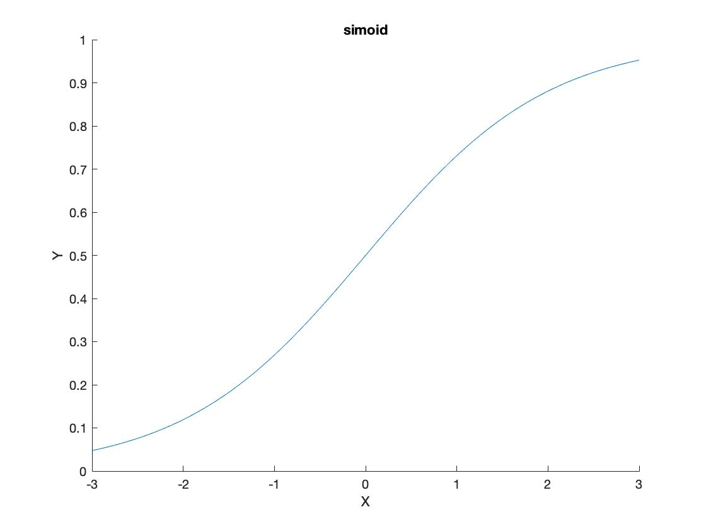
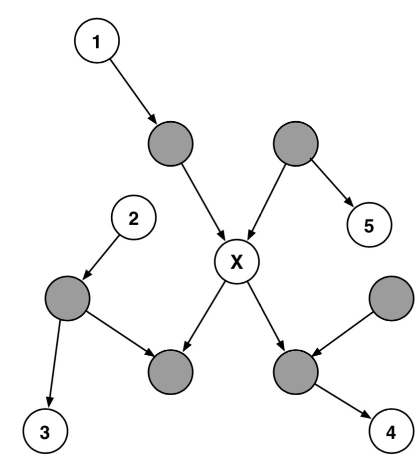

# CSE250A HW2

**Name:** Guanghao Chen

**PID:** A53276390

**Section:** A

## 2.1 Probabilistic inference

###(a)

$\begin{align}P(A=1)&=P(A=1,E=0,B=0)+P(A=1,E=0,B=1)+P(A=1,E=1,B=0)+P(A=1,E=1,B=1)\\
&=P(A=1|E=0,B=0)P(E=0)P(B=0)+P(A=1|E=0,B=1)P(E=0)P(B=1)\\
&+P(A=1|E=1,B=0)P(E=1)P(B=0)+P(A=1|E=1,B=1)P(E=1)P(B=1)\\
&=0.0025\end{align}$

$P(A=0)=1-P(A=1)=0.9975$

$\begin{align}P(J=1)&=P(J=1,A=0)+P(J=1,A=1)\\
&=P(J=1|A=0)P(A=0)+P(J=1|A=1)P(A=1)\\
&=0.0521\end{align}$

$\begin{align}P(A=0|E=1)&=P(A=0|B=0,E=1)P(B=0)+P(A=0|B=1,E=1)P(B=1)\\
&=(1-0.29)(1-0.001)+(1-0.95)0.001\\
&=0.7093\end{align}$

$P(A=1|E=1)=0.2907$

Therefore,

$\begin{align}P(E=1|J=1)&=\frac{0.7093\times 0.002}{0.9975}\cdot \frac{0.05\times 0.9975}{0.0521}+\frac{0.2907\times 0.002}{0.0025}\cdot \frac{0.09\times 0.0025}{0.0521}\\
&=0.0116\end{align}$

### (b)

$\begin{align}P(E=1|J=1,B=1)&=\frac{P(J=1|B=1,E=1)P(E=1|B=1)}{P(J=1|B=1)}\\
&=\frac{\sum_a{P(J=1,A=a|B=1,E=1)}P(E=1)}{\sum_{a,e}{P(J=1,A=a,E=e|B=1)}}\;(marginalization)\\\end{align}$

Numerator:

$\begin{align}
&\sum_a{P(J=1,A=a|B=1,E=1)P(E=1)}\\
&=P(E=1)\times[P(J=1|A=0,B=1,E=1)P(A=0|B=1,E=1)+P(J=1|A=1,B=1,E=1)P(A=1|B=1,E=1)]\\
&=P(E=1)\times[P(J=1|A=0)P(A=0|B=1,E=1)+P(J=1|A=1)P(A=1|B=1,E=1)]\\
&=0.002\times 0.8575\\&=0.0017\end{align}$

Denominator:

$\begin{align}&\sum_{a,e}{P(J=1,A=a,E=e|B=1)}\\&=P(J=1,A=0,E=0|B=1)+P(J=1,A=0,E=1|B=1)\\&+P(J=1,A=1,E=0|B=1)+P(J=1,A=1,E=1|B=1)\\&=P(J=1|A=0,E=0,B=1)P(A=0|E=0,B=1)P(E=0)\\&+P(J=1|A=1,E=0,B=1)P(A=1|E=0,B=1)P(E=0)\\&+P(J=1|A=0,E=1,B=1)P(A=0|E=1,B=1)P(E=1)\\&+P(J=1|A=1,E=1,B=1)P(A=1|E=1,B=1)P(E=1)\\&=
P(J=1|A=0)P(A=0|E=0,B=1)P(E=0)\\&+P(J=1|A=1)P(A=1|E=0,B=1)P(E=0)\\&+P(J=1|A=0)P(A=0|E=1,B=1)P(E=1)\\&+P(J=1|A=1)P(A=1|E=1,B=1)P(E=1)\\&=0.8490\end{align}$

Therefore,

$P(E=1|J=1,B=1)=\frac{0.0017}{0.8490}= 0.0020$

### (c)

$\begin{align}P(A=1|M=0)&=\frac{P(M=0|A=1)P(A=1)}{P(M=0)}\\
&=\frac{(1-P(M=1|A=1))P(A=1)}{P(M=0)}\\
&=\frac{0.3\times0.0025}{0.9883}\\
&=0.00075887\end{align}$

### (d)

$\begin{align}P(A=1|J=0,M=0)&=\frac{P(M=0,J=0|A=1)P(A=1)}{P(J=0,M=0)}\\
&=\frac{P(J=0|A=1)P(M=0|A=1)P(A=1)}{\sum_{a}{P(J=0,M=0,A=a)}}\\
&=\frac{0.1\times0.3\times0.0025}{0.95\times0.99\times0.9975+0.1\times0.3\times0.0025}\\
&=0.00008\end{align}$

### (e)

$\begin{align}P(M=0)&=P(M=0,A=0)+P(M=0,A=1)\\
&=P(M=0|A=0)P(A=0)+P(M=0|A=1)P(A=1)\\
&=(1-0.01)0.9975+(1-0.7)0.0025\\
&=0.9883\end{align}$

$P(M=1)=0.0117​$

$\begin{align}P(A=1|M=1)&=\frac{P(M=1|A=1)P(A=1)}{P(M=1)}\\
&=\frac{0.70\times0.0025}{0.0117}\\
&=0.1496\end{align}$

### (f)

$\begin{align}P(A=1|M=1,B=0)&=\frac{P(M=1,B=0|A=1)P(A=1)}{P(M=1,B=0)}\\
&=\frac{P(M=1|A=1)P(B=0|A=1)P(A=1)}{\sum_a{P(M=1,B=0|A=a)P(A=a)}}\\
&=\frac{P(M=1|A=1)P(B=0|A=1)P(A=1)}{P(M=1|A=0)P(B=0|A=0)P(A=0)+P(M=1|A=1)P(B=0|A=1)P(A=1)}\\
\end{align}$

$\begin{align}P(B=0|A=0)&=P(B=0,E=0|A=0)+P(B=0,E=1|A=0)\\
&=\frac{P(A=0|B=0,E=0)P(B=0)P(E=0)}{P(A=0)}+\frac{P(A=0|B=0,E=1)P(B=0)P(E=1)}{P(A=0)}\\
&=\frac{(1-0.001)(1-0.001)(1-0.002)}{0.9975}+\frac{(1-0.29)(1-0.001)0.002}{0.9975}\\
&=0.999923\end{align}$

$\begin{align}P(B=0|A=1)
&=\frac{(0.001)(1-0.001)(1-0.002)}{0.0025}+\frac{(0.29)(1-0.001)0.002}{0.0025}\\
&=0.6306\end{align}$

Therefore,

$\begin{align}P(A=1|M=1,B=0)&=0.09962\end{align}$

Therefore, 

Compared the result of (b) versus (a), it seems consistent with the commonsense pattern of reasoning, which means the prob will be less when John calls.

Compared the result of (d) versus (c), the result is consistent with the commonsense pattern, which means the prob will be less when John makes calls.

Compared the result of (f) versus (e), the result is consistent with the commonsense patern, which means the prob will be less when actually there's no burglar.

## 2.2 Probabilistic reasoning

### (a)

Numerator of $r_{k}$:

$\begin{align}P(D=1|S_1=1,S_2=1,...S_k=1)&=\frac{P(S_1=1,S_2=1,...,S_k=1|D=1)}{P(S_1=1,S_2=1,...,S_k=1)}\;(CI2)\\
&=\frac{\prod_{k=1}{P(S_k=1|D=1)}}{P(S_1=1,S_2=1,...,S_k=1)}\\
&=\frac{1\times \frac{f(1)}{f(2)}\times\frac{f(2)}{f(3)}\times...\times\frac{f(k-1)}{f(k)}}{P(S_1=1,S_2=1,...,S_k=1)}\\
&=\frac{\frac{f(1)}{f(k)}}{P(S_1=1,S_2=1,...,S_k=1)}\\
&=\frac{\frac{1}{2^k+(-1)^k}}{P(S_1=1,S_2=1,...,S_k=1)}\end{align}$

Denominator of $r_k$:

$\begin{align}P(D=0|S_1=1,S_2=1,...S_k=1)&=\frac{P(S_1=1,S_2=1,...,S_k=1|D=0)}{P(S_1=1,S_2=1,...,S_k=1)}(CI2)\\
&=\frac{P(S_1=1|D=0)P(S_2=1|D=0)...P(S_k=1|D=0)}{P(S_1=1,S_2=1,...,S_k=1)}\\
&=\frac{\frac{1}{2^k}}{P(S_1=1,S_2=1,...,S_k=1)}\end{align}$

Then

$\begin{align}r_k&=\frac{\frac{1}{2^k+(-1)^k}}{\frac{1}{2^k}}\\
&=\frac{2^k}{2^k+(-1)^k}\end{align}$

Therefore, when k is an odd integer, $r_k=\frac{2^k}{2^k-1}>1$, and the patient will be diagnose as $D=1$ form.

When k is an even integer,  $r_k=\frac{2^k}{2^k+1}<1$,and the patient will be diagnose as $D=0$ form.,

### (b)

As $k$ values becomes larger, it means $k\rightarrow\infty$ . Then 

When k is and odd number, $r_k=\frac{1}{1-\frac{1}{2^k}}$.

Then $r_k$ will be 1.

Likewise,

$r_k$ will also be 1 when k is an even number.

Therefore, the result will be less certain when the k goes up.

## 2.3 Sigmoid function

### (a)

$\begin{align}\sigma^{-1}(z)&=\frac{0\times(1+e^{-z})+1\times(e^{-z})}{(1+e^{-z})^2}\\
&=\frac{e^{-z}}{(1+e^{-z})^2}\end{align}$

At the same time

$\begin{align}\sigma(z)\times\sigma(-z)&=\frac{1}{1+e^{-z}}\times\frac{1}{1+e^{z}}\\
&=\frac{1}{1+e^{-z}}\times\frac{e^{-z}}{e^{-z}+1}\\
&=\frac{e^{-z}}{(1+e^{-z})^2}\end{align}$

Therefore, it concludes that $\sigma^{-1}(z)=\sigma(z)\times \sigma(-z)$

### (b)

$\begin{align}\sigma(z)+\sigma(-z)&=\frac{1}{1+e^{-z}}+\frac{1}{1+e^{z}}\\
&=\frac{1}{1+e^{-z}}+\frac{e^{-z}}{e^{-z}+1}\\
&=\frac{1+e^{-z}}{1+e^{-z}}=1\end{align}$

### (c)

$\begin{align}L(\sigma(z))&=log(\frac{\sigma(z)}{1-\sigma(z)})\\
&=log(\frac{\frac{1}{1+e^{-z}}}{1-\frac{1}{1+e^{-z}}})\\
&=log(\frac{1}{1+e^{-z}-1})\\
&=log(\frac{1}{e^{-z}})\\
&=log(e^{z})=z\end{align}​$

### (d)

Since $p_i=P(Y=1|X_i,X_j=0\; for\;all\;j\ne i)$ ,

Therefore $p_i=\sigma(w_i)$.

Furthur,

$L(p_i)=L(\sigma(w_i))=w_i$ (according to the conclusion in problem (c))

## 2.4 Conditional independence 

|     X     |    Y     |             Z              |
| :-------: | :------: | :------------------------: |
|   month   |  water   |      {sprinkler,rain}      |
|   month   |  water   | {sprinkler,rain,accidenct} |
|   month   | accident |     {sprinkler,water}      |
|   month   | accident |        {rain,water}        |
|   month   | accident |      {sprinkler,rain}      |
|   month   | accident |          {water}           |
|   month   | accident |   {sprinkler,rain,water}   |
| sprinkler |   rain   |          {month}           |
| sprinkler | accident |          {water}           |
| sprinkler | accident |       {water, month}       |
| sprinkler | accident |       {water, rain}        |
| sprinkler | accident |    {water, month, rain}    |
|   rain    | accident |          {water}           |
|   rain    | accident |       {water, month}       |
|   rain    | accident |       {water, rain}        |
|   rain    | accident |    {water, month, rain}    |

 ## 2.5 Markov blanket

Proof:

There're 5 cases for node Y.

**Case1: Node Y is the parent of X's parent**

For example, node 1 meets this case. The right top gray node is the evidence. Therefore, d-seperation case 1 is satisfied, where left top gray node is flowed through.(node1=> evidence => nodeX)

**Case2: Node Y is the child of X's parent**

For example, node 5 meets this case. The right top gray node is the evidence. Therefore, d-seperation case 2 is satisfied, where right top gray node is diversed.(node5 <= evidence => nodeX)

**Case3: Node Y is the parent of X's child's parent**

For example, node 2 meets this case. There's a path satisfying conditional independence case1, where an evidence node is flowed through.(node2 => **nodex's child's parent** => nodex's child => nodeX)

**Case4: Node Y is the child of X's child's parent**

On the contrary, node 3 is the child of node x's child's parent. So there's a path satisfying conditional independence case2, where an evidence node is diversed.(node2 <= **nodex's child's parent** => nodex's child => nodeX)

**Case5: Node Y is the child of X's child**

Node 4 is the child of node x's child. So there's a path satisfying conditional independence case1, where an evidence node is flowed through.(nodex => **nodex's child** => node4)

All in all, no matter node Y meets which case, it must have $P (X, Y |BX ) = P (X|B_X )P (Y |B_X ).$

## 2.6 True or false

| Value |      Formula            |
| :---: | :---------------:       |
| True  |  $P(C,D|A)=P(A|S)$      |
| False |  $P(A|D)=P(A|B,D)$      |
| True |  $P(C,E)=P(C)P(E)$      |
| False |  $P(C,D,E)=P(C)P(D)P(E)$|
| False |  $P(F,G) = P(F)P(G)$    |
| True  |  $P(F,G|D)=P(F|D)P(G|D)$|
| False |  $P(A,D,G)=P(A)P(D|A)P(G|D)$|
| False |  $P(B|E)=P(B|E,G)$ |
| False |  $P(C|E)=P(C|E,G)$ |

## 2.7 Subsets

### (a)

$P(A|C)=P(A|C,E,F,B,D,G)\;S= \{C,E,F,B,D,G\}$

### (b)

$P(C)=P(C|B,D,G)\;S=\{B,D,G\}$

### (c)

$P(C|A)=P(C|A,B,D,G)\;S=\{A,B,D,G\}$

### (d)

$P(C|A,E)=P(C|A,E,D,B,G)\;S=\{A,E,D,B,G\}$

### (e)

$P(C|A,E,F)=P(C|A,E,F)\;S=\{A,E,F\}$

### (f)

$P(C|A,D,E,F)=P(C|A,D,E,F,G)\;S=\{A,B,D,E,F,G\}$

### (g)

$P(F)=P(F)\;S=\{\}$

### (h)

$P(F|C)=P(F|C,E)\;S=\{A,C,E\}$

### (i)

$P(F|C,D)=P(F|C,D,E,G)\;S=\{A,B,C,D,E,G\}$

###(j)

$P(B,G)=P(B,G|A,C,E)\;S=\{A,C,E\}$

## 2.8 Noisy-OR

###(a) 

$left = 1 - 1=0$

$right = 1 - (1-p_y)=p_y$

$\therefore left<right$

### (b) 

$left=1 - (1-p_x)=p_x$

$right=1 - (1-p_y)=p_y$

$\therefore left<right$

### (c)

$left=1 - (1-p_x)=p_x$

$right=1 - (1-p_x)(1-p_y)=(p_x+p_y-p_xp_y)$

$right-left = p_y-p_xp_y=p_y(1-p_x)>0$

$\therefore left < right$

### (d)

$left=right$ (d-seperation $\textrm{III}$) 

### (e)

$left<right$

### (f)

$left>right$

### (g)

$\begin{align}right&=P(X=1,Y=1,Z=1)\\
&=P(Z=1|X=1,Y=1)P(X=1,Y=1)\\
&=P(Z=1|X=1,Y=1)P(X=1)P(Y=1)\end{align}$

$left=P(Z=1)P(X=1)P(Y=1)$

Compared to no evidence, it is more likely to make $Z=1$ when $X=1,Y=1$.

Therefore, $left<right$.

## 2.9 Polytree inference

### (a)

$\begin{align}P(B)&=\sum_{a}{P(B|A=a)P(A=a)}\end{align}$

### (b)

$\begin{align}P(D|C)&=\sum_{b}{P(D|B=b,C)}P(B=b|C)\\
&=\sum_{b}{P(D|B=b,C)P(B=b)}\end{align}$

Insert the result from (a).

$P(D|C)=\sum_{b}{P(D|B=b,C)[\sum_{a}{P(B|A=a)P(A=a)}]}$

### (c)

$\begin{align}P(F|C,E)&=\sum_{d}{P(F,D=d|C,E)}\\
&=\sum_{d}{P(F|C,D=d,E)P(D=d|C,E)}\\
&=\sum_d{P(F|D=d,E)\{\sum_{b}{P(D|B=b,C)[\sum_{a}{P(B|A=a)P(A=a)}]\}}}\end{align}$

### (d)

$\begin{align}P(E|C,F)&=\frac{P(F|C,E)P(E|C)}{P(F|C)}\\
&=\frac{P(F|C,E)P(E)}{P(F|C)}\end{align}$

$\begin{align}P(F|C)&=\sum_e{P(F,E=e|C)}\\&=\sum_{e}{P(F|C,E=e)P(E=e|C)}\\
&=\sum_{e}{P(F|C,E=e)P(E=e)}\end{align}$

Therefore,

$P(E|C,F)=\frac{\{\sum_d{P(F|D=d,E)\{\sum_{b}{P(D|B=b,C)[\sum_{a}{P(B|A=a)P(A=a)}]\}\}}}\times P(E)}{\sum_{e}\{{\sum_d{P(F|D=d,E)\{\sum_{b}{P(D|B=b,C)[\sum_{a}{P(B|A=a)P(A=a)}]\}}}\}P(E=e)}}$

### (e)

In order to calculate the result  of $P(E|C,F)$, we need to traverse n possible values for variable E to calculate $P(F|C)$. Then in order to calcualte $P(F|C)$, we need to traverse  n possible values for variable D in term $P(F|C,E)$. Further, we need to traverse n possible values for variable B in calculating $P(D=d|C)$. Finally, we need to traverse n possibilities for variable A. The whole process is recursive from the top to the bottom.

All in all, the calculation complexity is polynomial and the degree is 4.