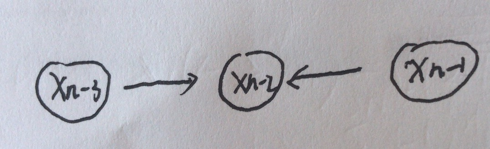

# CSE 250 A

NAME: Guanghao chen

PID: A53276390

Email: guc001@eng.ucsd.edu

# 4.1 Maximum likelihood estimation of a multinomial distribution

## (a) Log-likelihood

$\begin{align}P(data) &= \prod^{T}{P(X=x^{(t)})}\\
&=\prod^{2n}{P(X=n)^{C_n}}\\
&=\prod^{2n}{p_n^{C_n}}\end{align}$

Therefore, the log-likelihood can be denoted by inserting  the P(data).

$\begin{align}L&=log(P(data))\\
&=log(\prod^{2n}{p_n^{C_{n}}})\\
&=\sum^{2n}{log(p_n^{C_n})}\\
&=\sum^{2n}{C_nlog(p_n)}\end{align}$

## (b) Maximum likelihood estimate

As the hint says, we can use the Lagrange multiplier to calculate the maximum.

So the target function can be denoted by 
$$
\begin{align}L(p_i,\lambda) &= \sum^{2n}{C_nlog(p_n)} +\lambda (1-\sum^{2n}{p_n})\\\end{align}
$$
Then, calculate the partial derivative of the target function with respect to $p_i$ and $\lambda$

$\left\{
\begin{align}\frac{\part{L}}{\part p_i}&=\frac{c_i}{p_i}-\lambda=0\\
\frac{\part{L}}{\part{\lambda}}&=(1-\sum^{2n}{p_n})=0\end{align}\right.$

Therefore we can first denote $p_i$ with $\lambda$, namely
$$
p_i=\frac{c_i}{\lambda}
$$
Then, we substitute the fomula into the second equation and produce 
$$
\lambda = \sum^{2n}{c_i}
$$
Therefore, 
$$
p_i = \frac{c_i}{\sum^{2n}{c_i}}
$$

## (c)

Since the tosses are identically, independent distributed, the probability for even tosses and odd ones can be denoted by 

$P(even)=P(x=2\;or\;x =4\;or ... or\;2n)=P(2)+P(4)+...+P(2n)=p_2+p_4+...p_{2n}$

$P(odd)=P(x=1\;or\;x =3\;or ... or\;2n-1) = P(1)+P(3)+...+P(2n-1)=p_1+p_3+...p_{2n-1}$

The given equation also can be denoted by

$\begin{align}\sum_{n=1}^{2N}{(-1)^np_n}&=(p_2+p_4+...+p_{2n})-(p_1+p_3+...+p_{2n-1})\\
&=P(even)-P(odd)=0\end{align}$

Therefore, it shows that $P(even)=P(odd)$.

## (d)

According to Lagrange multiplier, the target function can be denoted as follow.
$$
L= \sum_{i=1}^{2N}{c_ilog(p_i)}+\lambda_1(1-\sum_{i=1}^{2N}{p_i})+\lambda_2(-1)^ip_i
$$
Then, by calculating the partial derivitive of the target function with respect to $$p_i$$, $$\lambda_1$$ and $$\lambda_2$$, it has
$$
\left\{\begin{align}\frac{\part L}{\part p_i}&=\frac{c_i}{p_i}-\lambda_1+(-1)^i\lambda_2&=0\\
\frac{\part L}{\part \lambda_1}&=1-\sum_{i=1}^{2N}{p_i}&=0\\
\frac{\part L}{\part \lambda_2}&=\sum_{i=1}^{2N}{(-1)^i p_i}&=0
\end{align}\right.
$$
First we multiply $p_i$to the first equation to produce
$$
\begin{align}c_i-\lambda_1p_i+(-1)^i\lambda_2p_i&=0\\
\sum_{i=1}^{2N}{c_i}-\lambda_1\sum_{i=1}^{2N}{p_i}+\lambda_2\sum_{i=1}^{2N}{(-1)^ip_i}&=0\\
\sum_{i=1}^{2N}{c_i}-\lambda_1&=0\\\lambda_1&=\sum_{i=1}^{2N}{c_i}\end{align}
$$
Basing on the similar process mentioned above, we can multiply $(-1)^ip_i$to the first equation again.
$$
\begin{align}(-1)^ic_i-(-1)^i\lambda_1p_i+\lambda_2p_i&=0\\
\sum_{i=1}^{2N}{(-1)^ic_i}-\lambda_1\sum_{i=1}^{2N}{(-1)^ip_i}+\lambda_2\sum_{i=1}^{2N}{p_i}&=0\\
\sum_{i=1}^{2N}{(-1)^ic_i}+\lambda_2&=0\\\lambda_2&=-\sum_{i=1}^{2N}{(-1)^ic_i}\end{align}
$$
Then we substitute $\lambda_1$ and $\lambda_2$ into the first equation again to deduce $p_i$.
$$
\begin{align}\frac{c_i}{p_i}-\lambda_1+(-1)^i\lambda_2&=0\\\frac{c_i}{p_i}-\sum_{i=1}^{2N}{c_i}-(-1)^i\sum_{i=1}^{2N}{(-1)^ic_i}&=0\\
p_i&=\frac{c_i}{\sum_{i=1}^{2N}{c_i}+(-1)^i\sum_{i=1}^{2N}{(-1)^ic_i}}\end{align}
$$

# 4.2 Maximum likelihood estimation in belief networks

## (a)

$P(x_i=x^{'}|x_{i-1}=x)=\frac{count_{i-1}(x,x^{'})}{count_{t-1}(x)}$

## (b)

$P(x_{i-1}=x|x_{i}=x^{'})=\frac{count_{i-1}(x,x^{'})}{count_{t-1}(x^{'})}$

## (c)

The joint distribution for G1:

$\begin{align}P(x_1,x_2,...,x_n)&=P(X_n|X_{n-1})P(X_{n-1}|X_{n-2})...P(X_2|X_1)P(X_1)\\
&=\frac{count_{n-1}(x_{n-1},x_{n})}{count_{n-1}(x_{n-1})}\cdot \frac{count_{n-2}(x_{n-2},x_{n-1})}{count_{n-2}(x_{n-2})}...\frac{count_{1}(x_{1},x_{2})}{count_{1}(x_{1})}\cdot \frac{count_{1}(x_{1})}{|data|}\\
&=\frac{count_{n-1}(x_{n-1},x_{n})}{count_{n-1}(x_{n-1})}\cdot \frac{count_{n-2}(x_{n-2},x_{n-1})}{count_{n-2}(x_{n-2})}...\frac{count_{1}(x_{1},x_{2})}{|data|}\end{align}$

The joint distribution for G2:

$\begin{align}P(x_1,x_2,...,x_n)&=P(X_1|X_{2})P(X_{2}|X_{3})...P(X_{n-1}|X_{n})P(x_n)\\
&=\frac{count_{1}(x_{1},x_{2})}{count_{2}(x_{2})}\cdot \frac{count_{2}(x_{2},x_{3})}{count_{3}(x_{3})}...\frac{count_{n-1}(x_{n-1},x_{n})}{count_{n}(x_{n})}\cdot \frac{count_{n}(x_{n})}{|data|}\\&=\frac{count_{1}(x_{1},x_{2})}{count_{2}(x_{2})}\cdot \frac{count_{2}(x_{2},x_{3})}{count_{3}(x_{3})}...\frac{count_{n-1}(x_{n-1},x_{n})}{|data|}\end{align}$

Therefore, the two joint distribution is equal.

## (d)

Take node $x_{n-2}$ for instance. 

The subgraph arond node $x_{n-2}$ shows as the following .



Accroding to the graph, we can conclude that the node $x_{n-3}$and $x_{n-1}$ are not independent given node $x_{n-2}$ because the arrow direction is not diversed.

Therefore, the joint distribution is not as the same as the previous two graphs G1 and G2.

# 4.3 Statistical language modeling

## (a)

```python
Word Starting With A,Prob
A,0.018407244690712494
AND,0.017863233925020615
AT,0.004312974000612439
AS,0.003991797167406474
AN,0.002999256673943544
ARE,0.0029896926709136874
ABOUT,0.0019256178376532746
AFTER,0.0013465675979453587
ALSO,0.0013100115812493978
ALL,0.001181814804064031
A.,0.0010256109080316418
ANY,0.0006318601694814718
AMERICAN,0.0006120961939108219
AGAINST,0.000595964582662253
ANOTHER,0.0004283866165304179
AMONG,0.00037429251755208585
AGO,0.0003565709825261751
ACCORDING,0.0003475451075440342
AIR,0.00031100132103097604
ADMINISTRATION,0.0002915186396670866
AGENCY,0.0002796553622515356
AROUND,0.00027685465036683335
AGREEMENT,0.00026278994002880895
AVERAGE,0.00025907196442640943
ASKED,0.00025822808180612795
ALREADY,0.0002490799049949608
AREA,0.0002310893059451922
ANALYSTS,0.00022603824040640604
ANNOUNCED,0.00022715118705054536
ADDED,0.00022121954834276986
ALTHOUGH,0.00021426057427117345
AGREED,0.00021177784714193957
APRIL,0.00020669009105444552
AWAY,0.00020205485173434878
```

## (b)

```
The <UNK>		0.6150198100055118
The U.		    0.013372499432610317
The FIRST		0.011720260675031612
The COMPANY		0.011658788055636611
The NEW		    0.009451480076516552
```

## (c)

Log-likelihoods of this sentence under unigram model: -64.50944034364878.

Log-likelihoods of this sentence under bigram model: -44.740469213403735.

Therefore, bigram model yields to the highest log-likelihood.

## (d)

Log-likelihoods of this sentence under unigram model: -41.64345971649364.

The pairs $P(officials|nineteen)$ and $P(fire|sold)$ are not observed in the training corpus. The effect is that their probability  will be 0 and further the log-likelihood will cause a domain error.

## (e)

The optimal value is $-39.953751575277174$, where $\lambda=0.4083469387755102$.

The plot is in the attachment.

# 4.4 Markov modeling

## (a) Unigram model

|      | a             | b    | c    | d    |
| ---- | :---: | :---: |:---:| :---:|
|      | $\frac{1}{4}$ | $\frac{1}{4}$ | $\frac{1}{4}$ | $\frac{1}{4}$ |

## (b) Bigram model

|      |       a       |       b       |       c       |       d       |
| :--: | :-----------: | :-----------: | :-----------: | :-----------: |
|  a   | $\frac{2}{3}$ |       0       |       0       | $\frac{1}{3}$ |
|  b   |       0       | $\frac{3}{4}$ | $\frac{1}{4}$ |       0       |
|  c   |       0       | $\frac{1}{4}$ | $\frac{2}{4}$ | $\frac{1}{4}$ |
|  d   | $\frac{1}{4}$ |       0       | $\frac{1}{4}$ | $\frac{2}{4}$ |

## (c) Likelihoods

$P_U(S)=P_U(T_1)$

$P_U(S)=P_U(T_2)$

$P_U(S)=P_U(T_3)$

$P_B(S)>P_B(T_1)$

$P_B(S)>P_B(T_2)$

$P_B(T_2)=P_B(T_3)$

$P_B(S)>P_U(S)$

$P_B(T_1)=P_U(T_1)$

$P_B(T_2)<P_U(T_2)$

$P_B(T_3)<P_U(T_3)$

## (d)

The plots for each sequence is D,A,C,B.

# 4.5 Stock Market Prediction

## (a)

$$
\begin{align}a1 &= 0.9506733661404788\\
a2 &= 0.01560133077286545\\
a3 &= 0.03189568516025264\end{align}
$$


## (b)

2000's Mean Square Error is 13902.401076367885
2001's Mean Square Error is 2985.0979241108607

Therefore, I won't recommend this linear model for stock prediction because of the high mean squared error.

## (c)

See the attachment.