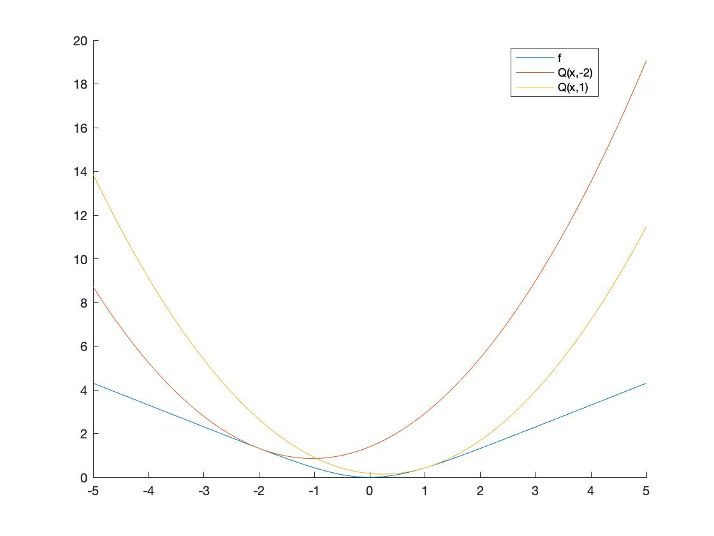

# 250A SectionA HW6 

PID : A53276390

Name: Guanghao Chen

Email: guc001@eng.ucsd.edu

## 6.1

Survey Completed.

## 6.2

### (a) Posterior probability

$$
\begin{align}P(a,c|b,d) &= \frac{P(a,b,c,d)}{P(b,d)}
\\&= \frac{P(a,b,c,d)}{\sum_{a',c'}{P(a',b,c',d)}}
\\&= \frac{P(a)P(b|a)P(c|a,b)P(d|a,b,c)}{\sum_{a',c'}{P(a')P(b|a')P(c'|a',b)P(d|a,b,c')}}
\end{align}
$$

## (b) Posterior probability

$$
\begin{align}P(a|b,d) &= \sum_{c'}P(a,c'|b,d) \\
P(c|b,d) &= \sum_{a'}P(a',c|b,d) \end{align}
$$

### (c) Log-likelihood

$$
\begin{align}L &= \sum_t{logP(B=b_t,D=d_t)}\\
&=\sum_t{log\sum_{a',c'}P(A=a',B=b_t,C=c',D=d_t)}\\
&=\sum_t{log\sum_{a',c'}P(A=a')P(B=b_t|A=a')P(C=c'|A=a',B=b_t)P(D=d_t|A=a',B=b_t,C=c')}\end{align}
$$

### (d) EM algorithm

$$
P(A) = \frac{1}{T}\sum_t{P(a|b_t,c_t)}
$$

$$
\begin{align}P(B=b|A=a) &= \frac{\sum_t{P(b,a|b_t,d_t)}}{\sum_t{P(a|b_t,d_t)}}\\
&=\frac{\sum_t{I(b,b_t)P(a|b_t,d_t)}}{\sum_t{P(a|b_t,d_t)}}\end{align}\\
$$

$$
\begin{align}P(C=c|A=a,B=b) &= \frac{\sum_t{P(c,b,a|b_t,d_t)}}{\sum_t{P(a,b|b_t,d_t)}}\\
&=\frac{\sum_t{I(b,b_t)P(a,c|b_t,d_t)}}{\sum_t{I(b,b_t)P(a|b_t,d_t)}}\end{align}\\
$$

$$
\begin{align}P(D=d|A=a,B=b,C=c) &= \frac{\sum_t{P(a,b,c,d|b_t,d_t)}}{\sum_t{P(a,b,c|b_t,d_t)}}\\
&=\frac{\sum_t{I(b,b_t)I(d,d_t)P(a,c|b_t,d_t)}}{\sum_t{I(b,b_t)P(a,c|b_t,d_t)}}\end{align}
$$

## 6.3 EM algorithm for noisy -OR

### (a)

$$
\begin{align}P(Y=1|X) &= \sum_{Z=\{0,1\}}P(Y=1,Z|X)\\
&=\sum_{Z=\{0,1\}}P(Y=1|Z,X)P(Z|X)\\
&=\sum_{Z=\{0,1\}}P(Y=1|Z)P(Z|X)\\
&=\sum_{Z=\{0,1\}}(1-I(Z,\vec{0}))P(Z|X)\\
&=\sum_{Z=\{0,1\}}\{P(Z|X)-I(Z,\vec{0})P(Z|X)\}\\
&=\sum_{Z=\{0,1\}}P(Z|X)-P(Z=\vec{0}|X)\\
&=1 - \prod(1-p_i)^{x_i}
\end{align}
$$

### (b)

$$
\begin{align}P(Z_i=1,X_i=1|X=x,Y=y)&=P(x_i=1|X=x,Y=y)P(z_i=1|X=x,Y=y,x_i=1)\\
&=I(x_i,1)P(z_i=1|x,y)\\
&=I(x_i,1)\frac{P(y|z_i=1,x)P(z_i=1|x)}{P(y|x)}\\
&=\frac{I(x_i,1)I(y,1)p_iI(x_i,1)}{P(y|x)}\\
&=\frac{yx_ip_i}{1-\prod_{i=1}^n(1-p_i)}\end{align}
$$

### (c)


$$
\begin{align}p_i &= \frac{\sum_tP(Z_i=1,X_i=1|X=x^{(t)},Y=y^{(t)})}{\sum_tP(x_i=1|X=x^{(t)},Y=y^{(t)})}\\
&=\frac{\sum_tP(Z_i=1,X_i=1|X=x^{(t)},Y=y^{(t)})}{\sum_t{I(x_{i}^{t},1)}}\\
&=\frac{1}{T_i}\sum_tP(Z_i=1,X_i|X=x^{(t)},Y=y^{(t)})\end{align}
$$

### (d)

| 0    | 195  | -1.044559748133717   |
| ---- | ---- | -------------------- |
| 1    | 60   | -0.504940510120726   |
| 2    | 43   | -0.4107637741779621  |
| 4    | 42   | -0.3651271742872333  |
| 8    | 44   | -0.3476632119425764  |
| 16   | 40   | -0.33467666667097906 |
| 32   | 37   | -0.3225926894510678  |
| 64   | 37   | -0.3148310623857991  |
| 128  | 36   | -0.31115581742409987 |
| 256  | 36   | -0.3101611042419867  |

### (e)

```python
X = []
Y = []
with open('spectX.txt') as f:
    lines = f.readlines()
    for line in lines[:-1]:
        line = line.strip('\n').split(' ')[:-1]
        temp = []
        for item in line:
            temp.append(int(item))
        X.append(temp)
    line = lines[-1].strip('\n').split(' ')
    temp = []
    for item in line:
        temp.append(int(item))
    X.append(temp)
    
with open('spectY.txt') as f:
    lines = f.readlines()
    for line in lines:
        line = line.strip('\n').split(' ')
        Y.append(int(line[0]))
X = np.array(X)
Y = np.array(Y)

def noiseOR(X, Y, p):
    temp = np.power((np.array([1]*len(p)) - np.array(p)),X)
    product = reduce((lambda x, y: x * y), temp)
    if Y==1:
        product = 1 - product
    return product

def prob(X, Y, p):
    temp = np.power((np.array([1]*len(p)) - np.array(p)),X)
    product = reduce((lambda x, y: x * y), temp)
    return 1 - product

def logLikelihood(X, Y, p):
    tmp = 0.0
    for i in range(len(X)):
        tmp += log(noiseOR(X[i], Y[i], p))
    return tmp / len(X)

def EM(X, Y, p):
    tmp = [0.0] * len(p)
    count = [0] * len(p)
    for t in range(X.shape[0]):
        for j in range(len(p)):
            if X[t][j] == 1:
                count[j] += 1
            tmp[j] += Y[t]*X[t][j]*p[j]/noiseOR(X[t], Y[t], p)
    for i in range(len(p)):
        tmp[i] /= count[i]
    return tmp

def countMistakes(X, Y, p):
    mistakes = 0
    for t in range(X.shape[0]):
        if(prob(X[t], Y[t], p) >=0.5 and  Y[t]==0) or (prob(X[t], Y[t], p) <=0.5 and  Y[t]==1):
            mistakes += 1
    return mistakes

p = [1/23]*23
index = [0,1,2,4,8,16,32,64,128,256]
for i in range(300):
    if i in index:
        mistake = countMistakes(X,Y,p)
        print("Iteration:{}, Mistakes:{}, Log-Likelihood:{}".format(i,mistake,logLikelihood(X, Y, p)))
    p = EM(X, Y, p)
```

## 6.4 Auxiliary function

### (a)

Enforcing $f^{'}(x)=0$,
$$
\begin{align}
f^{'}(x) &= \frac{sinh(x)}{cosh(x)}\\
&=\frac{\frac{e^x-e^{-x}}{2}}{\frac{e^x+e^{-x}}{2}}\\&=0\\
\therefore \frac{e^x-e^{-x}}{2}=0\end{align}
$$

$$
f^{''}(x) = \frac{cosh^2(x)-sinh^2(x)}{cosh^2(x)}=\frac{1}{cosh^2(x)}\geq0
$$

Therefore, when $x=0$, the minimum occurs.

###(b)

According to the graph of $coshx$, it concludes that $coshx\geq1$, therefore $\frac{1}{cosh^2x}\leq1$.

### (c)



### (d)

Substitute y in Q(x,y) with x, Q(x,x) = f(x).

For ii, because of $f^{''}(x)<=1$
$$
\begin{align}Q(x,y) - f(x) &= f(y)+f^{'}(y)(x-y)+\frac{1}{2}(x-y)^2-f(y)-\int_y^xdu[f^{'}(u)+\int_y^udvf^{''}(v)]\\
&=\frac{1}{2}(x-y)^2-\int_y^xdu\int_y^udvf^{''}(v)\\
&\geq\frac{1}{2}(x-y)^2-\int_y^xdu\int_y^udv\\
&=\frac{1}{2}(x-y)^2-\int_y^x(u-y)du\\
&=\frac{1}{2}(x-y)^2-\frac{1}{2}(x-y)^2\\
&=0\end{align}
$$
Therefore,$Q(x,y)\geq f(x)$.

### (e)

When $y=x_n$, the function $Q(x,x_n)$ will be the following.
$$
Q(x,x_n) = f(x_n)+f^{'}(x_n)(x-x_n)+\frac{1}{2}(x-x_n)^2
$$
Therefore,
$$
Q(x,x_n) = f^{'}(x_n)+(x-x_n)=0\\
x_{n+1} = x_n-f^{'}(x_n) = x_n - \frac{sinhx}{coshx}
$$

### (f)

```python
x_0 = -2
x_1 = 1
iters = []
xn = []
xn1 = []
for i in range(20):
    iters.append(i)
    x_0 = x_0-(exp(2*x_0)-1)/(exp(2*x_0)+1)
    x_1 = x_1-(exp(2*x_1)-1)/(exp(2*x_1)+1)
    xn.append(x_0)
    xn1.append(x_1)
plt.plot(iters,xn)
plt.plot(iters,xn1)
plt.legend(['x0=-2','x0=1'])
plt.title('Converge Process')
plt.xlabel('Iterations')
plt.ylabel('Value')
plt.show()
```


### (g)

When $x_0=-2$, the update rule can't converge. While for $x_0=1$, the update rule can converge. 

By numerical method, we dermine the uppper bound is $x_0 = 1.0612$.

### (h)


### (i)

$$
\because g^{'}(x) = \frac{1}{10}\sum_{k=1}^{10}\frac{sinh(x+\frac{1}{k})}{cosh(x+\frac{1}{k})}\\
\therefore g^{''}(x) = \frac{1}{10}\sum_{k=1}^{10}\frac{1}{cosh^2(x+\frac{1}{k})}\leq1
$$

Therefore, we can similarly prove the $R(x,y) - g(x)$ by the process represented in part (d).

### (j)

Similarly as part (e), the update rule can be donoted as
$$
\begin{align}x_{n+1} &= x_n -g^{'}(x)\\
&=x_n - \frac{1}{10}\sum_{k=1}^{10}\frac{sinh(x+\frac{1}{k})}{cosh(x+\frac{1}{k})}
\end{align}
$$

### (k)

The minimum of function $g(x)$ is 0.0327 when $x=-0.2830$.

```python
def gFun(x):
    res = 0
    for k in range(1,11):
        res += log(cosh(x+1/k))
    return res/10

def gDiff(x):
    res = 0
    for k in range(1,11):
        res += sinh(x+1/k)/cosh(x+1/k)
    return res/10

#find the minimum
x_iter = -2
iters = []
nextValue = []
for i in range(20):
    iters.append(i)
    x_iter = x_iter - gDiff(x_iter)
    nextValue.append(x_iter)
    
plt.plot(iters,nextValue)
plt.title('Converge Process For Minimazing g(x)')
plt.xlabel('Iterations')
plt.ylabel('Value')
plt.show()
print("Minimum for g(x) is {}".format(gFun(nextValue[-1])))
```


