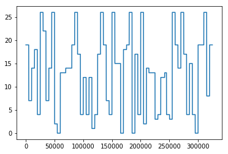

# 250A SectionA HW7

Guanghao Chen

PID: A53276390

Email: guc001@eng.ucsd.edu

## 7.1 Viterbi algorithm

**The hidden messge is **

**"THOSE WHO CANOT REMEMBER THE PAST ARE CONDEMNED TO REPEAT IT"**

```python
import numpy as np
from matplotlib import pyplot as plt
with open("emissionMatrix.txt",'r') as f:
    emissionF = f.readlines()
with open("initialStateDistribution.txt",'r') as f:
    initStateF = f.readlines()
with open("observations.txt",'r') as f:
    obsvF = f.readlines()
with open("transitionMatrix.txt",'r') as f:
    transF = f.readlines()
bM = np.zeros((27,2))
for index,line in enumerate(emissionF):
    item0,item1 = line.strip().split("\t")
    bM[index][0] = float(item0)
    bM[index][1] = float(item1)

pi = np.zeros((27,))
for index,line in enumerate(initStateF):
    pi[index] = float(line.strip())

obsvM = np.array([int (i) for i in obsvF[0].strip().split(" ")])

aM = np.zeros((27,27))
for index,line in enumerate(transF):
    items = line.strip().split(" ")
    for j,item in enumerate(items):
        aM[index][j] = float(item)
print("Start forwardrecursion...")
l = []
base = [0] * 27
for i in range(27):
    base[i] = np.log(pi[i]) + np.log(bM[i][obsvM[0]])
l.append(base)
T = obsvM.shape[0]
phi = []
for t in range(1,T):
    baseline = [0] * 27
    phiTmp   = [0] * 27
    for j in range(27):
        maxTmp = l[t-1][0] + np.log(aM[0,j])
        for i in range(1,27):
            if (l[t-1][i] + np.log(aM[i,j])) > maxTmp:
                maxTmp = l[t-1][i] + np.log(aM[i,j])
                phiTmp[j] = i
        baseline[j] = maxTmp + np.log(bM[j,obsvM[t]])
    phi.append(phiTmp)
    l.append(baseline)

print("Start backtracking...")
maxTmp = l[T-1][0]
index = 0
for i in range(1, 27):
    if l[T-1][i] > maxTmp:
        maxTmp = l[T-1][i]

S = [index]
i = T-2
while (i >= 0):
    index = phi[i][index]
    S = [index] + S
    i -= 1
plt.plot(range(T),S)

message = chr(S[0]+65)
for index in range(1,T):
    if(S[index]!=S[index-1] and S[index]!=26):
        message += chr(S[index]+65)
    elif(S[index]!=S[index-1] and S[index]==26):
        message += ' '
print("The encoded hidden message is:",message)
```



## 7.2 Inference in HMMs

### (a)

$$
\begin{align}&P(S_t=i|S_{t+1}=j,O_1,O_2,...,O_T)\\
&= \frac{P(S_{t+1}=j,S_t=i,O_1,O_2,...,O_T)}{P(S_{t+1}=j,O_1,O_2,...,O_T)}&(PR)\\
&=\frac{P(S_t=i,O_1,...,O_t)P(S_{t+1}=j|S_t=i,O_1,O_2,...,O_t)\times\\P(O_{t+1}|S_{t+1}=j,S_t=i,O_1,...,O_t)P(O_{t+2},...O_T|S_{t+1}=j,S_t=i,O_1,...,O_{t+1})}{P(S_{t+1}=j,O_1,O_2,...,O_T)}&(PR)\\
&=\frac{P(S_t=i,O_1,...,O_t)P(S_{t+1}=j|S_t=i)P(O_{t+1}|S_{t+1}=j)P(O_{t+2},...O_T|S_{t+1}=j)}{\sum_kP(S_{t+1}=j,S_t=k,O_1,...,O_T)}&(Mar,CI)\\
&=\frac{\alpha_{it}a_{ij}b_{j}(O_{t+1})\beta_{jt+1}}{\sum_k{\alpha_{kt}a_{kj}b_{j}(O_{t+1})\beta_{jt+1}}}
\end{align}
$$

### (b)

$$
\begin{align}&P(S_{t+1}=j|S_t=i,O_1,O_2,...,O_T)\\
&=\frac{P(S_{t+1}=j,S_t=i,O_1,O_2,...,O_T)}{P(S_{t+1}=k,S_t=i,O_1,O_2,...,O_T)}&(PR+Mar)\\
&=\frac{\alpha_{it}a_{ij}b_{j}(O_{t+1})\beta_{jt+1}}{\sum_k{\alpha_{it}a_{ik}b_{k}(O_{t+1})\beta_{kt+1}}}\\
\end{align}
$$

### (c)

$$
\begin{align}&P(S_{t-1}=i,S_{t}=k,S_{t+1}=j|o_1,o_2,...,o_T)\\
&=\frac{P(S_{t-1}=i,S_{t}=k,S_{t+1}=j,o_1,o_2,...,o_T)}{P(o_1,o_2,...,o_T)}\\
&=\frac{P(o_1...,o_{t-1},S_{t-1}=i)\times\\P(S_{t}=k|S_{t-1}=i,o_1...,o_{t-1})\times\\P(O_{t}|S_t=k,S_{t-1}=i,o_1...,o_{t-1})\times\\P(S_{t+1}=j|S_t=k,S_{t-1}=i,o_1,...,o_{t})\times\\P(O_{t+1}|S_{t+1}=j,S_t=k,S_{t-1}=i,o_1,...,o_{t})\times \\P(O_{t+2}...O_T|S_{t+1}=j,S_t=k,S_{t-1}=i)}{\sum_i{\alpha_{iT}}} &(PR+MAR)\\
&=\frac{P(o_1...,o_{t-1},S_{t-1}=i)P(S_{t}=k|S_{t-1}=i)P(O_{t}|S_t=k)\times \\P(S_{t+1}=j|S_t=k)P(O_{t+1}|S_{t+1}=j)P(O_{t+2}...O_T|S_{t+1}=j）}{\sum_i{\alpha_{iT}}}&(CI)\\
&=\frac{\alpha_{it-1}a_{ik}b_{k}(O_t)a_{kj}b_{j}(O_{t+1})\beta_{jt+2}}{\sum_i{\alpha_{iT}}}
\end{align}
$$

### (d)

$$
\begin{align}&P(S_{t-1}=i|S_{t+1}=j,o_1,o_2,...,o_T)\\
&=\frac{P(S_{t-1}=i,S_{t+1}=j,o_1,o_2,...,o_T)}{P(S_{t+1}=j,O_1,O_2,...,O_T)}&(PR)\\
&=\frac{\sum_k{P(S_{t-1}=i,S_t=k,S_{t+1}=j,o_1,o_2,...,o_T)}}{\sum_k{P(S_{t+1}=j,S_t=k,o_1,o_2,...,o_T)}}&(Mar)\\
&=\frac{\sum_{k}{\alpha_{it-1}a_{ik}b_{k}(O_t)a_{kj}b_{j}(O_{t+1})\beta_{jt+2}}}{\sum_k{\alpha_{kt}a_{kj}b_{j}(O_{t+1})\beta_{jt+1}}\sum_i{\alpha_{iT}}}
\end{align}
$$

## 7.3 Conditional independence

| $P(S_t|S_{t-1})=P(S_t|S_{t-1},O_t)$ | false |
| :---------------------------------: | ----- |
| $P(S_t|S_{t-1})=P(S_t|S_{t-1},S_{t+1})$ | false |
| $P(S_t|S_{t-1})=P(S_t|S_{t-1},O_{t-1})$| true  |
|  $P(S_t|O_{t-1})=P(S_t|O_1,O_2,...,O_{t-1})$ | false |
|$P(O_{t}|S_{t-1})=P(O_t|S_{t-1},O_{t-1})$ | true  |
|$P(O_{t}|O_{t-1})=P(O_t|O_{1},O_2,...,O_{t-1})$ | false |
|$P(O_1,O_2,...,O_T)=\prod_{t=1}^T{P(O_t|O_1,...,O_{t-1})}$|true|
|$P(S_2,S_3,...,S_T|S_1)=\prod_{t=2}^T{P(S_t|S_{t-1})}$|true|
|$P(S_1,S_2,...,S_{T-1}|S_1)=\prod_{t=1}^{T-1}{P(S_t|S_{t-1})}$| true  |
|$P(O_1,O_2,...,O_T\S_1,S_2,...,S_T)=\prod_{t=1}^T{P(O_t|S_{t})}$|true|
|$P(S_1,S_2,...,S_T\O_1,O_2,...,O_T)=\prod_{t=1}^T{P(S_t|O_t)}$|false |
|$P(S_1,S_2,...,S_T,O_1,O_2,...,O_T)=\prod_{t=1}^T{P(S_t,O_t)}$| false |

## 7.4 Belief updating

### (a)

$$
\begin{align}q_{jt} &= P(S_t=j|O_1,O_2,...,O_t)\\
&=\frac{P(S_t=j,O_1,O_2,...,O_t)}{P(O_1,O_2,...,O_t)}\\
&=\frac{\sum_i{P(S_t=j,S_{t-1}=i,O_1,O_2,...,O_t})}{\sum_{k,i}{P(S_t=k,S_{t-1}=i,O_1,O_2,...,O_t)}}\\
&=\frac{\sum_j{P(O_1,O_2,...,O_{t-1})P(S_{t-1}=i|O_1,O_2,...,O_{t-1})P(S_t=j|S_{t-1}=i)P(O_t|S_{t}=j)}}{\sum_{k,i}{P(O_1,O_2,...,O_t)P(S_{t-1}=i|O_1,O_2,...,O_{t-1})P(S_{t}=k|S_{t-1}=i)P(O_{t}|S_{t}=k)}}\\
&=\frac{b_{j}(O_t)\sum_j{q_{i(t-1)}a_{ji}}}{\sum_{kj}{q_{i(t-1)}a_{ik}}b_k(O_t)}
\end{align}
$$

### (b)

$$
\begin{align}&P(x_t|y_1,y_2...,y_t)\\
&=\frac{P(x_t,y_1,y_2...,y_t)}{P(y_1,y_2...,y_t)}&(PR)\\
&=\frac{\int{dx_{t-1}P(x_t,x_{t-1},y_1,y_2...,y_t)}}{\int dx_t\int dx_{t-1}P(x_t，x_{t-1},y_1,y_2...,y_t)}&(MAR)\\
&=\frac{\int{dx_{t-1}P(y_t|x_t)P(x_t=j|x_{t-1})P(x_{t-1}|y_1,y_2...,y_{t-1})P(y_1,y_2...,y_{t-1})}}{\int dx_t\int dx_{t-1}P(y_t|x_t)P(x_t=j|x_{t-1})P(x_{t-1}|y_1,y_2...,y_{t-1})P(y_1,y_2...,y_{t-1})}&(PR\&d-sep)\\
&=\frac{P(y_t|x_t)\int{dx_{t-1}P(x_t|x_{t-1})P(x_{t-1}|y_1,y_2...,y_{t-1})}}{\int P(y_t|x_t)dx_t\int dx_{t-1}P(x_t|x_{t-1})P(x_{t-1}|y_1,y_2...,y_{t-1})}
\end{align}
$$

The reason why it's difficult for all is it's difficult to compute the integrals of conditional probability. However, if $P(x)$ is Gaussian, then $P(x_t|x_{t-1})$ is also Gaussian. So it will be easier to compute the integrals.

##  7.5 V-chain

### (a) Base case

$$
\begin{align}&P(Y_1=j,O_1=o_1)\\
&=\sum_{i}P(P_1=o_1,Y_1=j,X_1=i)\\
&=\sum_{i}P(P_1=o_1|Y_1=j,X_1=i)P(X_1=i)P(Y_1=j)\\
&=\{\sum_{i}{b_{ij}(o_1)P(X_1=i)}\}\pi_{j}\\
\end{align}
$$

### (b) Forward Algorithm

$$
\begin{align}\alpha_{j(t+1)}&=P(o_1,o_2,...,o_{t+1},Y_{t+1}=j)\\
&=\sum_i{P(o_1,o_2,...,o_{t+1},X_{t+1}=i,Y_{t+1}=j)}&(marginalization)\\
&=\sum_i{P(o_{t+1}|X_{t+1}=i,Y_{t+1}=j)P(X_{t+1}=i,Y_{t+1}=j,o_1,...,o_t)}&(PR+d-sep)
\end{align}
$$

The second term can be denoted by 
$$
\begin{align}&P(X_{t+1}=i,Y_{t+1}=j,o_1,...,o_t)\\
&=\sum_k{P(X_{t+1}=i,Y_t=k,Y_{t+1}=j,o_1,...,o_t)}&(marginalization)\\
&=\sum_k{P(Y_t=k,o_1,...,o_t)P(X_{t+1}=i|Y_t=k,o_1,...,o_t)\times\\P(Y_{t+1}=j|X_{t+1}=i,Y_t=k,o_1...,o_t)}&(PR)\\
&=\sum_k{\alpha_{kt}a_{ki}\pi_j}
\end{align}
$$
Then substituting the result into the second term
$$
\begin{align}\alpha_{j(t+1)}&=\sum_ib_{ij}(o_{t+1})\sum_k{\alpha_{kt}a_{ki}\pi_j}\end{align}
$$

### (c) Likelihood

$$
\begin{align}P(o_1,o_2,...,o_T)
&=\sum_j{P(o_1,o_2,...,o_T,Y_T=j)}\\
&=\sum_j{\alpha_{jT}}\end{align}
$$

### (d) Complexity

The base case $\alpha_{j1}$ is shown in part (a) and its complexity is $n_x$.

Then using the base case, we can compute the next case $\alpha_{j2}$ and its complextiy is $n_xn_y$.

And so on until computing out $\alpha_{jT}$, the whole process should cost $[(T-1)n_xn_y+n_x]$.

Further, there are $n_y$ cases for index j. Therefore, the whole complexity is $n_y[(T-1)n_xn_y+n_x]$.

All in all, the complexity is $O(n_xn_y^{2}T)$.

 


